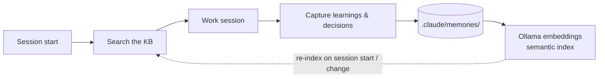

# Memory

A [tech pack](https://github.com/mcs-cli/mcs) that gives Claude Code **persistent memory across sessions** (formerly "Continuous Learning"). Claude Code forgets everything the moment a session ends — this pack captures debugging discoveries, architectural decisions, and project conventions into a searchable knowledge base, so Claude gets increasingly effective at *your* codebase instead of starting from zero every time.

```
identifier: memory
requires:   mcs >= 2026.4.12
```

---

## Install

```bash
brew install mcs-cli/tap/mcs      # 1. install mcs
mcs pack add mcs-cli/memory       # 2. register this pack
mcs sync --global                 # 3. install globally (~/.claude)
mcs doctor                        # 4. verify everything is healthy
```

**Prerequisites:** macOS, [Claude Code](https://docs.anthropic.com/en/docs/claude-code), and an embeddings runtime. `mcs` installs the rest (Node, `gh`, `jq`) automatically. If nothing is already serving embeddings, the pack installs [Ollama](https://ollama.com) and pulls `nomic-embed-text` for you.

Global is the recommended scope — this pack has no per-project config, so installing once makes memory available in every project automatically. To scope it to a single repo instead, run `mcs sync` from inside that repo.

### Already run your own embeddings server?

The pack needs one thing: an OpenAI-compatible `/v1/embeddings` on `localhost:11434` that returns a vector for `nomic-embed-text`. It does not care what serves it. If llama.cpp, LM Studio, or vLLM is already answering there, nothing is installed and nothing is pulled — no Ollama, no second server competing for the port.

Three things to know if you bring your own:

- **Alias the model name.** llama.cpp's router matches the request's `model` field against a section name or alias, so `nomic-embed-text` won't resolve on its own. Add `alias = nomic-embed-text` to that model's section in your preset file.
- **The endpoint has to actually embed.** `/v1/embeddings` needs a model that supports embeddings and a pooling type other than `none`. A server that's up and answering `/v1/models` still fails the model check if it can only chat — which is the intended diagnosis, not a bug.
- **Wipe the store when you switch providers.** `docs-mcp-server` pins the embedding model *name* when the store is first created, so swapping the thing behind that name changes your vectors while every check still passes. Run `rm -rf ~/Library/Application\ Support/docs-mcp-server`; the session-start hook re-indexes.

Non-default ports and remote hosts aren't configurable yet — the endpoint is currently fixed at `localhost:11434`.

---

## How it works



1. **Session starts** — a hook re-indexes `.claude/memories/` into a local vector store (Ollama `nomic-embed-text`), in the background.
2. **Before any task** — Claude is instructed to search the knowledge base first, surfacing relevant past learnings and decisions.
3. **Before delegating** — sub-agents can't see the parent's KB results, so they'd rediscover everything from scratch. A gate hook closes that gap from both ends: it requires the findings to be pasted into the sub-agent's prompt, and tells any discovery agent to search the KB itself if they weren't. Configurable per project, from a reminder up to a hard block.
4. **During work** — a prompt-submit hook reminds Claude to notice when the current interaction produces knowledge worth saving.
5. **After valuable work** — the `continuous-learning` skill extracts structured memories, checks for duplicates, and writes them to `.claude/memories/`.
6. **Next session** — the new memories are indexed and surfaced again. The loop compounds: debugging patterns aren't rediscovered, decisions aren't re-litigated, conventions aren't re-explained.

---

## Gate modes

Installing this pack asks one question: how strictly the gate in step 3 should hold the rule. It's the only prompt in the pack, and the answer is remembered at sync time.

| Mode | When a discovery sub-agent is spawned without KB findings | Pick it when |
|---|---|---|
| `warn` *(default)* | Claude gets a reminder; the agent runs anyway | You want the nudge, never an interruption |
| `enforce` | The spawn is denied, naming what's missing and how to retry | You want the rule actually held |
| `observe` | Nothing is said, the decision is logged | You want to see how often it would fire before switching it on |
| `off` | Nothing at all — no gating, no sub-agent briefing | You've opted out; the instruction stays in `CLAUDE.local.md`, nothing checks it |

`enforce` cannot wedge a session: denials are budgeted per turn, so a spawn always gets through eventually even if the rule is never satisfied. Every mode except `off` also briefs discovery sub-agents at startup and records its decisions to `.claude/.kb-gate.log`.

To change the answer later, re-run `mcs sync` — the mode is baked into the installed hook, not read from a setting at runtime.

---

## What's included

| Component | What it does |
|---|---|
| **docs-mcp-server** (MCP) | Read-only semantic search over `.claude/memories/`, backed by local Ollama embeddings |
| **continuous-learning** (skill) | Extracts learnings and decisions from a session into structured memory files |
| **memory-audit** (skill) | Reviews existing memories and flags stale or duplicate entries to keep the KB lean |
| **sync-memories.sh** (hook) | Indexes/re-indexes memories on session start and when they change mid-session |
| **continuous-learning-activator.sh** (hook) | Reminds Claude to check for extractable knowledge after each prompt |
| **kb-gate.sh** (hook) | Keeps the KB lookup ahead of delegated discovery: warns or blocks when a sub-agent is spawned without the findings in its prompt, and tells discovery sub-agents the KB exists so they search it instead of sweeping files blind |
| `autoMemoryEnabled: false` (setting) | Disables Claude Code's built-in memory in favor of this system |

Memories come in two flavors, both stored as version-controlled, human-readable markdown:

- **Learnings** — non-obvious discoveries from debugging, e.g. `learning_orm_batch_insert_memory_spike.md`. Template: *Problem → Trigger Conditions → Solution → Verification → Example → Notes*.
- **Decisions** — deliberate architecture/convention choices, e.g. `decision_testing_snapshot_strategy.md`. ADR-inspired template: *Decision → Context → Options Considered → Choice → Consequences*.

---

## Directory structure

```
memory/
├── techpack.yaml                        # Manifest — defines all components
├── config/settings.json                 # Disables built-in auto-memory
├── checks/
│   └── embedding-runtime.sh             # Doctor check: is any embedding runtime available?
├── hooks/
│   ├── sync-memories.sh                 # Endpoint health + memory indexing/reindexing
│   ├── continuous-learning-activator.sh # Knowledge extraction reminder
│   └── kb-gate.sh                       # Keeps KB lookups ahead of delegated discovery
├── skills/
│   ├── continuous-learning/             # Extraction rules + memory templates
│   └── memory-audit/                    # Audit workflow (KEEP/DROP/UPDATE)
└── templates/
    └── continuous-learning.md           # "Search KB before any task"
```

---

## Companion pack

**[shared-memories](https://github.com/mcs-cli/shared-memories)** extends this pack by auto-syncing `.claude/memories/` across teammates via a dedicated git repo. Install both together for team-shared memory — `mcs-cli/memory` captures and retrieves, `shared-memories` distributes.

---

## You might also like

| Pack | Description |
|---|---|
| [dev](https://github.com/mcs-cli/dev) | Foundational settings, plugins, and git workflows |
| [ios](https://github.com/mcs-cli/ios) | Xcode integration, simulator management, and Apple documentation |

---

## Links

- [MCS](https://github.com/mcs-cli/mcs) — the configuration engine
- [Creating Tech Packs](https://github.com/mcs-cli/mcs/blob/main/docs/creating-tech-packs.md)
- [Tech Pack Schema](https://github.com/mcs-cli/mcs/blob/main/docs/techpack-schema.md)

---

## License

MIT
