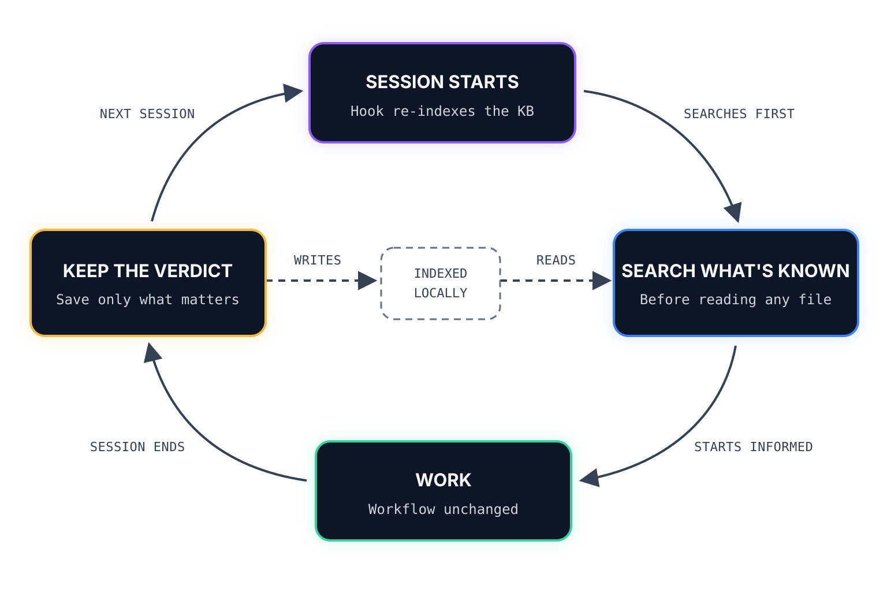

<div align="center">

# The Memory Loop

### Claude Code that learns your codebase, session after session.

[](https://github.com/mcs-cli/mcs)
[](https://docs.anthropic.com/en/docs/claude-code)


</div>

**The Memory Loop** gives Claude Code persistent, project-specific memory. It captures debugging discoveries, architectural decisions, and local conventions in a searchable knowledge base—then brings the right context back into future sessions. Instead of rediscovering the same lessons, Claude gets increasingly effective at working in *your* codebase.

> The project was formerly called **Memory**, and originally **Continuous Learning**. Its repository, package coordinate, and internal identifiers remain unchanged for compatibility.

```text
identifier: memory
requires:   mcs >= 2026.4.12
```

## Install

```bash
brew install mcs-cli/tap/mcs      # 1. install mcs
mcs pack add mcs-cli/memory       # 2. register this pack
mcs sync --global                 # 3. install globally (~/.claude)
mcs doctor                        # 4. verify everything is healthy
```

**Prerequisites:** macOS, [Claude Code](https://docs.anthropic.com/en/docs/claude-code), and Node 22 or newer. `mcs` installs the remaining dependencies (`gh`, `jq`, and [qmd](https://github.com/tobi/qmd)) automatically. The first sync also downloads a shared ~610 MB embedding model. Everything runs locally, with no daemon left running between sessions.

Global installation is recommended because the pack has no per-project configuration. Install it once and memory becomes available in every project. To scope it to a single repository instead, run `mcs sync` from inside that repository.

## How the loop works

<p align="center">
  <picture>
    <source media="(prefers-color-scheme: dark)" srcset="assets/the-memory-loop-dark.svg">
    <source media="(prefers-color-scheme: light)" srcset="assets/the-memory-loop-light.svg">
    
  </picture>
</p>

1. **Search** — before a task, Claude searches the project's knowledge base for relevant past learnings and decisions.
2. **Work** — retrieved context informs debugging, implementation, and architectural choices during the session.
3. **Capture** — after valuable work, the `continuous-learning` skill extracts structured memories and checks for duplicates.
4. **Store** — memories remain human-readable Markdown in `.claude/memories/`, ready to review and version with the project.
5. **Re-index** — hooks update the local vector store at session start and whenever memories change. The next search closes the loop.

The same context also reaches delegated discovery work. Because sub-agents cannot see the parent agent's search results, a gate hook requires those findings to be included in their prompt—or tells the sub-agent to search the knowledge base itself.

## What it remembers

Memories are version-controlled, human-readable Markdown in two formats:

| Type | Best for | Structure |
|---|---|---|
| **Learnings** | Non-obvious discoveries from debugging, such as `learning_orm_batch_insert_memory_spike.md` | *Problem → Trigger Conditions → Solution → Verification → Example → Notes* |
| **Decisions** | Deliberate architecture or convention choices, such as `decision_testing_snapshot_strategy.md` | *Decision → Context → Options Considered → Choice → Consequences* |

The `memory-audit` skill reviews the collection over time, flagging stale or duplicate entries so the knowledge base stays useful rather than merely growing.

## Gate modes

During installation, the pack asks how strictly it should enforce searching the knowledge base before delegating discovery work. This is the only prompt, and the answer is stored at sync time.

| Mode | When a discovery sub-agent is spawned without KB findings | Pick it when |
|---|---|---|
| `enforce` *(default)* | The spawn is denied, naming what's missing and how to retry | You want the rule held consistently |
| `warn` | Claude gets a reminder; the agent runs anyway | You want the nudge, never an interruption |
| `observe` | Nothing is shown, but the decision is logged | You want to measure how often the gate would fire |
| `off` | No gating or sub-agent briefing occurs | You want to opt out entirely |

`enforce` cannot wedge a session: denials are budgeted per turn, so a spawn eventually proceeds even if the requirement is never satisfied. Every mode except `off` also briefs discovery sub-agents at startup and records decisions in `.claude/.kb-gate.log`.

To change the mode, run `mcs sync` again. The selection is baked into the installed hook rather than read from a runtime setting.

## What's included

| Component | What it does |
|---|---|
| **memory-loop** (MCP) | Searches `.claude/memories/` semantically using a local embedding model |
| **continuous-learning** (skill) | Extracts learnings and decisions from a session into structured memory files |
| **memory-audit** (skill) | Reviews existing memories and flags stale or duplicate entries |
| **sync-memories.sh** (hook) | Indexes memories at session start and re-indexes them when they change |
| **continuous-learning-activator.sh** (hook) | Reminds Claude to check for knowledge worth capturing after each prompt |
| **kb-gate.sh** (hook) | Keeps knowledge-base lookup ahead of delegated discovery work |
| `autoMemoryEnabled: false` (setting) | Disables Claude Code's built-in memory in favor of this system |

## Upgrading from the Ollama version

<details>
<summary>Cleanup guidance for releases that used docs-mcp-server and Ollama</summary>

Earlier releases indexed memories through `docs-mcp-server`, backed by an Ollama daemon. `mcs sync` converges on its own: it deregisters the old MCP server, and the next session builds the new index. No manual migration is required.

What `mcs` cannot remove is software installed by the old release through plain shell commands. If you want the disk space back—and **only if nothing else on your machine uses these tools or files**—you can run:

```bash
npm uninstall -g @arabold/docs-mcp-server
rm -rf ~/Library/Application\ Support/docs-mcp-server   # read the warnings below first
ollama rm nomic-embed-text
```

Check these points before removing anything:

- **`docs-mcp-server` may index external documentation.** Run `docs-mcp-server list` first to see what it contains.
- **Its store is shared across every indexed library.** Removing the directory deletes all of those indexes, not just project memories.
- **Ollama may serve other models.** Run `ollama list`; if `nomic-embed-text` is the only entry and nothing else needs the runtime, you can also remove `/Applications/Ollama.app` and `~/.ollama`. Removing the app clears its macOS Login Item.

The Memory Loop no longer installs or manages any of these components.

</details>

## Directory structure

```text
memory/
├── techpack.yaml                        # Manifest — defines all components
├── config/settings.json                 # Disables built-in auto-memory
├── hooks/
│   ├── sync-memories.sh                 # Memory indexing/reindexing
│   ├── continuous-learning-activator.sh # Knowledge extraction reminder
│   └── kb-gate.sh                       # Keeps KB lookups ahead of delegated discovery
├── skills/
│   ├── continuous-learning/             # Extraction rules + memory templates
│   └── memory-audit/                    # Audit workflow (KEEP/DROP/UPDATE)
└── templates/
    └── continuous-learning.md           # "Search KB before any task"
```

## Companion pack

**[shared-memories](https://github.com/mcs-cli/shared-memories)** extends The Memory Loop by syncing `.claude/memories/` across teammates through a dedicated Git repository. Install both for team-shared memory: `mcs-cli/memory` captures and retrieves knowledge, while `shared-memories` distributes it.

## You might also like

| Pack | Description |
|---|---|
| [dev](https://github.com/mcs-cli/dev) | Foundational settings, plugins, and Git workflows |
| [ios](https://github.com/mcs-cli/ios) | Xcode integration, simulator management, and Apple documentation |

## Links

- [MCS](https://github.com/mcs-cli/mcs) — the configuration engine
- [Creating Tech Packs](https://github.com/mcs-cli/mcs/blob/main/docs/creating-tech-packs.md)
- [Tech Pack Schema](https://github.com/mcs-cli/mcs/blob/main/docs/techpack-schema.md)

## License

MIT
